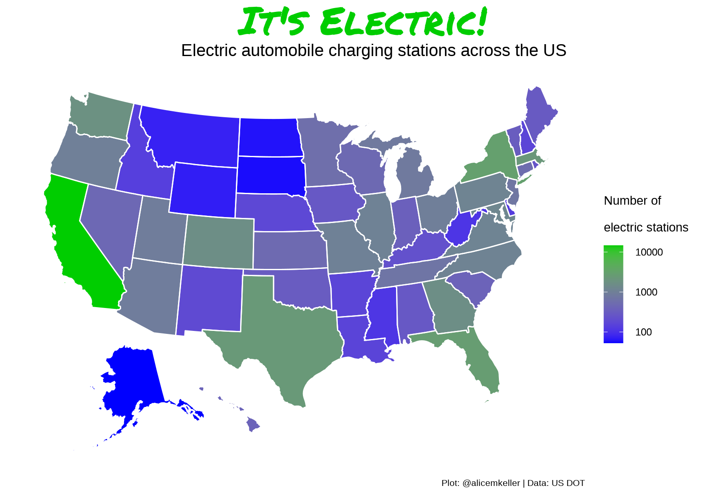
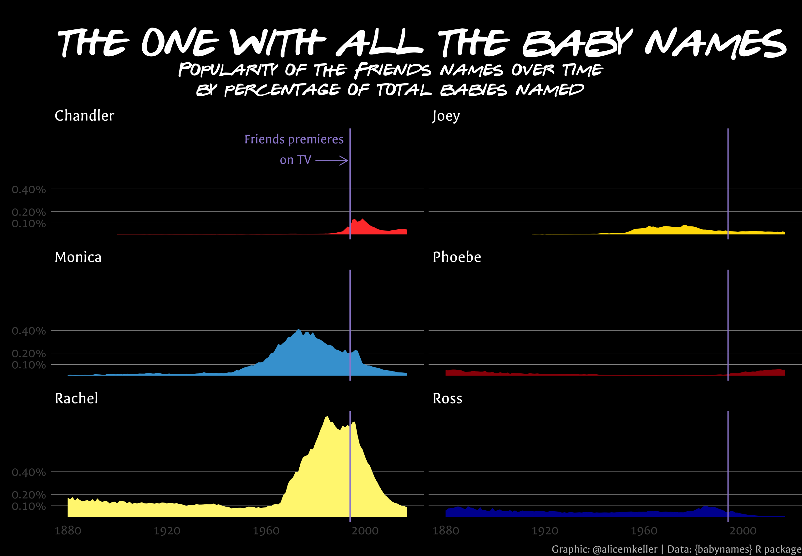

# TidyTuesday
Data visualization contributions to weekly #TidyTuesday challenge hosted by R for Data Science

## 2022 Week 9 - Alternative Fuel Stations
Alternative fuel stations across the USA. Data from US DOT.

## 2022 Week 12 - Baby Names
Looking at the popularity of the Friends' names over time. Data from `babynames` R package.

